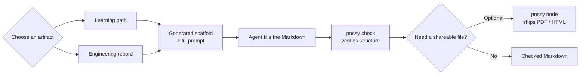

# pncsy

[](https://github.com/kushjaggi/pncsy/releases)
[](https://github.com/kushjaggi/pncsy#install)
[](LICENSE)

**Scaffold it. Check it. Ship it.**

`pncsy` creates structured learning paths and six verifiable engineering record types: **ADRs, architecture maps, execution flows, constraints, bug records, and handovers**. Agents fill the generated scaffold, `pncsy check` verifies its structure, and optional Node tooling ships any Markdown as PDF/HTML.

<p align="center">
  
</p>

<p align="center">
  <a href="#install">Install</a> ·
  <a href="#how-it-works">How it works</a> ·
  <a href="#learning-paths">Learning paths</a> ·
  <a href="#project-docs">Project docs</a> ·
  <a href="#how-this-compares">How this compares</a> ·
  <a href="#ship-docs">Ship docs</a> ·
  <a href="#ai-editors">AI editors</a> ·
  <a href="examples/demo/omnivoice-indian-speech-finetuning-path.md">Live example</a>
</p>

---

## The problem

| Today | With `pncsy` |
|-------|--------------|
| “Make me a roadmap” → different shape every time | Fixed ladder + sections + fill prompt — same structure, any model |
| An agent made a decision, traced a flow, or fixed a bug → the reasoning disappears next session | ADR, architecture, flow, constraints, bug, and handover records with a checkable shape |
| Agent dumps 40 pages of `.md` → you forward it raw | Polish → cover → auto TOC → Mermaid → PDF/HTML |
| Doc tools want `npm install` in *your* repo | One curl install; deps live in `~/.local/share/pncsy` only |

---

## How it works



**Two tiers.**

| | `pncsy learn` · project docs · `pncsy check` | `pncsy node` |
|---|---|---|
| **Runtime** | bash only | Node 18+ (opt-in) |
| **You get** | Scaffold, agent prompt, contract check | PDF, HTML, rendered Mermaid / Graphviz |
| **Use when** | Learning plans and durable engineering context | Sharing docs that should look finished |

---

## Install

```bash
curl -fsSL https://raw.githubusercontent.com/kushjaggi/pncsy/main/scripts/install.sh | bash
```

No Node. No npm. No clone. Adds `pncsy` to `~/.local/bin`.

<p align="center">
  
</p>

```bash
# pin a release (the variable must be passed to bash, not curl)
curl -fsSL https://raw.githubusercontent.com/kushjaggi/pncsy/main/scripts/install.sh \
  | PNCSY_VERSION=1.1.0 bash
```

Then try it:

```bash
pncsy learn "OmniVoice Indian Speech Finetuning" \
  --level advanced --depth deep
# → a Markdown scaffold + agent fill prompt

# when ready to ship (one-time: pncsy setup --node)
pncsy check omnivoice-indian-speech-finetuning-path.md --strict
pncsy node omnivoice-indian-speech-finetuning-path.md --pack --open
```

---

## What it produces

<p align="center">
  
</p>

<p align="center">
  
</p>

The gallery shows the whole loop: a complex filled learning path, a strict contract check, PDF/HTML shipping, and the six project-record commands. See the checked-in example: **[examples/demo/omnivoice-indian-speech-finetuning-path.md](examples/demo/omnivoice-indian-speech-finetuning-path.md)**.

---

## Learning paths

Every `pncsy learn` run writes **two files**:

| File | What it is |
|------|------------|
| `<topic>-path.md` | Scaffold — fixed headings, tables, level ladder |
| `<topic>-path.prompt.md` | Instructions for your agent to fill it (edit this freely) |

```bash
pncsy learn "Kafka" --level advanced --depth deep -o ./plans
```

**Level** — ladder stops at your target: `basic` → `intermediate` → `advanced` → `expert`  
**Depth** — how much per level: `quick` · `standard` · `deep`

| Depth | Concepts | Resources | Papers |
|-------|----------|-----------|--------|
| quick | 3 | 2 | — |
| standard | 5 | 3 | at advanced+ |
| deep | 8 | 5 | yes |

**Every path includes:** Snapshot · Prerequisites (with self-checks) · Level ladder (goals, concepts, resources, hands-on task) · Videos · Papers (when depth warrants) · Common traps · Glossary · Next steps

### Agent workflow

1. Run `pncsy learn "topic" …`
2. Open `.prompt.md` — tell your agent: *fill `.md` in place; keep every heading; tag uncertain links `(verify)`*
3. Verify: `pncsy check "<slug>-path.md"`
4. Ship: `pncsy node "<slug>-path.md" --pack --open`

Re-running `learn` keeps your edits. Use `--force` only when you want a clean slate.

### Did the agent actually follow the scaffold?

Agents drift — they drop a heading, leave `_placeholder_` text, or forget to resolve a `(verify)` tag. `pncsy check` rebuilds the scaffold from the `pncsy:learn` marker in your file and diffs against it:

```bash
$ pncsy check topic-path.md
topic-path.md  (Topic · intermediate · standard)

  ✗ missing heading   ## Glossary
  ✗ placeholder left  _why it matters_ (line 61)
  ! unresolved        (verify) × 3

FAIL  2 problem(s), 1 warning(s) — 1 file(s)
```

Exit `0` clean, `1` contract broken, `2` uncheckable — so it drops straight into CI or a pre-commit hook. `--strict` fails on warnings too.

**One command gates the repo.** With no argument, `check` finds every doc carrying a pncsy marker and verifies all of them. Files that merely *mention* the marker in prose or in a code fence are skipped, so it never flags your own README:

```bash
pncsy check                 # every pncsy doc, one exit code
pncsy check --json          # same, machine-readable
```

`--json` is for agents: `{ "ok", "checked", "errors", "files": [ { "file", "kind", "findings": [ { "severity", "type", "detail" } ] } ] }`. Point your agent at it and have it fix each `detail` until `ok` is true. One uncheckable doc is reported, not fatal — the scan still covers the rest.

---

## Project docs

The same scaffold → fill → check loop, pointed at the docs an AI-assisted codebase actually needs. Each writes a `.md` and a `.prompt.md`, and each is verifiable by `pncsy check`.

| Command | Writes | The section that earns it |
|---------|--------|---------------------------|
| `pncsy adr "<decision>"` | Decision record | **Alternatives rejected** — if you can't name one, you had no choice, not a decision |
| `pncsy arch ["<system>"]` | System map | **Boundaries** — what this system deliberately does not own |
| `pncsy flow "<path>"` | Execution trace | **Failure modes** — what each hop does when it breaks |
| `pncsy constraints` | Guardrails | **Never touch**, each with a concrete consequence; link it from `AGENTS.md` so agents load it |
| `pncsy bug "<symptom>"` | Incident record | **Blast radius** — the other callers you checked |
| `pncsy handover ["<label>"]` | Session handoff | **Next step** — exactly one, not a wishlist |

```bash
pncsy adr "Use Postgres over DynamoDB"
# → use-postgres-over-dynamodb-adr.md + .prompt.md
```

Fill it with your agent, then `pncsy check` it like anything else.

Unlabelled handovers are timestamped so a new session cannot silently reuse the
first `handover.md`. Pass a label when you want a stable, named record.

### Docs about code rot. These say so.

`arch` and `flow` describe live code, so they stamp the commit they were written against. When HEAD moves past it, `check` tells you the doc is describing a codebase that no longer exists:

```bash
$ pncsy check billing-arch.md
billing-arch.md  (arch · billing service)

  ! stale             describes 4e7422a, HEAD is cbc0f7c (+31 commits)

OK    contract kept, 1 warning(s)
```

Shape still valid, content probably not — which is the honest answer. `adr`, `bug`, and `handover` never warn: they're historical records, and an ADR from March is *supposed* to describe March.

<details>
<summary><strong>Custom structure</strong> (needs Node)</summary>

```bash
pncsy node learn --init-config    # writes pncsy.learn.json
```

Lookup: `--config <file>` → `./pncsy.learn.json` → `~/.config/pncsy/learn.json` → built-in defaults.

Custom paths record the config that created them. Keep that file available:
`pncsy check` uses Node to rebuild and verify the same shape.

```jsonc
{
  "levels": ["beginner", "working", "expert"],
  "depths": { "standard": { "concepts": 6 } },
  "sections": [
    { "id": "interview", "title": "Interview Q&A", "body": "| Q | A |\n|---|---|" }
  ],
  "promptRules": ["Your custom fill rules."]
}
```

Tokens: `{{topic}}` `{{levelTitle}}` `{{concepts}}` `{{ladder}}` — see [learn.default.mjs](scripts/learn.default.mjs).

</details>

---

## How this compares

There are good tools in this space, and most of them solve a *different* problem than `pncsy`. The split is worth understanding before you pick one.

| Tool | What it verifies | Where it stops |
|------|------------------|----------------|
| **`pncsy`** | **Doc vs. its own contract** — rebuilds the scaffold from the embedded marker and diffs | Cannot tell you the content is *true*, only that the shape survived |
| [fiberplane/drift](https://github.com/fiberplane/drift) | Doc vs. code — AST fingerprints per file or symbol, via `drift.lock` | Doesn't care what's *inside* the doc |
| [EvertDeveloper/archdrift](https://github.com/EvertDeveloper/archdrift) | Doc vs. repo structure — generates `ARCHITECTURE.md`, fails CI on structural drift | One document, structural only |
| [Arthur920/Staleguard](https://github.com/Arthur920/Staleguard) | Doc vs. reality — proves paths, commands, env vars, and import rules in prose are real | Doesn't know a doc was supposed to have sections |
| [Vercel `adr-skill`](https://github.com/vercel/ai), [tanRdev/auto-adr](https://github.com/tanRdev/auto-adr), [everything-claude-code](https://github.com/affaan-m/everything-claude-code) | Nothing — they generate an ADR | Never check what came back |

**The distinction that matters.** The drift tools ask *"has the code moved out from under this doc?"* `pncsy check` asks *"is this still the document we asked for?"* Those catch different failures. An agent handed an ADR scaffold will often produce something that reads beautifully because it quietly dropped **Alternatives rejected** — the one section that made the ADR worth writing. No code changed, so no drift tool fires. The generator skills never look at the result at all. `pncsy` rebuilds the original scaffold from the marker in your file and diffs, so a deleted section is a hard failure.

Beyond that: `pncsy` is a plain CLI, so it works in Cursor, Claude Code, Windsurf, Cline, or a CI job rather than one agent's skill folder; it covers **six** record types under one contract instead of ADRs alone; the whole scaffold-and-check tier is **bash with no Node**; and it ships anything to PDF/HTML, which none of the others do.

### When to use the others instead

Be honest about the boundaries — `pncsy` is deliberately narrow.

- **You want to know when code changed under a doc.** Use **fiberplane/drift**. It is genuinely better at this: tree-sitter AST fingerprints, symbol-level anchors, reformat-proof. `pncsy` only stamps a commit on `arch` and `flow` docs and warns that HEAD moved — coarse, and a warning rather than an error.
- **You want to prove your docs' claims are real.** Use **Staleguard**. It checks that every path, command, flag, and env var a doc mentions actually exists. `pncsy` does not check this at all.
- **You want a generated map of your repo.** Use **archdrift**. It reads your filesystem and writes the map for you. `pncsy` never reads your code — it produces an empty shape that a human or agent fills.
- **You're all-in on Claude Code and only need ADRs.** **Vercel's `adr-skill`** has a richer single-document workflow, with Socratic intent capture and implementation plans written for the next agent.

These compose fine. Running `pncsy check` for structure and `staleguard check` or `drift check` for code correspondence covers both halves, and nothing about them conflicts.

---

## Ship docs

Any `.md` file — learning paths, READMEs, agent dumps. Requires Node once:

```bash
pncsy setup --node    # one-time
```

```bash
pncsy node README.md --allow-html  # trusted raw HTML in this README
pncsy node guide.md --html     # HTML only
pncsy node guide.md --pack     # both
pncsy node docs/               # every .md except agent-only *.prompt.md
```

**Transforms on ship:**

- Strips “Sure! Here’s a comprehensive guide…” openings (`--no-polish` to keep)
- Teal cover page from `#` title + subtitle + chips
- Auto table of contents when ≥3 `##` headings
- Renders Mermaid and Graphviz (`dot`) diagrams
- Escapes raw HTML from Markdown by default; `--allow-html` is an explicit trust decision
- Clickable GitHub / arXiv links (underlined in PDF)
- Repo path linkification when `repo_base` is set in frontmatter

```yaml
---
title: My Doc
subtitle: Share-ready version
chips: [API, Auth, Deploy]
format: pack
repo_base: https://github.com/org/repo/blob/main
repo_tree: https://github.com/org/repo/tree/main   # optional; for paths ending in /
repo_paths: src, docs, examples                    # optional; default common prefixes
linkify_repo: false                                # optional; disable path linkification
---
```

With `repo_base` set, `` `src/foo.py` `` and `` `docs/guide.md` `` become clickable blob links. Use `repo_paths: *` to link any backtick path that contains `/`.

Working sample: **[examples/repo-links.md](examples/repo-links.md)** — `pncsy node examples/repo-links.md --pack`

<details>
<summary><strong>Additional ship flags</strong> (formats and output are shown above)</summary>

| Flag | Effect |
|------|--------|
| `--subtitle` / `--chips` / `--kicker` | Cover metadata |
| `--no-cover` / `--no-toc` / `--no-polish` | Skip cover, TOC, or fluff cleanup |
| `--no-repo-links` | Skip repo path / GitHub link enhancement |
| `--repo-base` / `--repo-tree` | Override frontmatter repo link bases |
| `--allow-html` | Render trusted raw HTML instead of escaping it |
| `--no-sandbox` | Disable Chrome sandbox for root-only containers |
| `--no-html-keep` | Delete intermediate HTML after PDF |
| `--meta <text>` | Cover metadata line |
| `--json` | `{ ok, results }` on stdout for agents |
| `--chrome <path>` | Override browser binary |

</details>

---

## AI editors

Works with **Cursor, Claude Code, Windsurf, Cline, Copilot** — anything that can run shell commands.

```bash
curl -fsSL https://raw.githubusercontent.com/kushjaggi/pncsy/main/scripts/install.sh | bash
ln -sfn ~/.local/share/pncsy/skill ~/.cursor/skills/pncsy
```

No skills folder? Put **[AGENTS.md](AGENTS.md)** in your project root — agents pick up when and how to call `pncsy`.

Per-editor setup: **[skill/INSTALL.md](skill/INSTALL.md)**

---

## Commands

```bash
pncsy learn "<topic>" [options]      # scaffold — no Node
pncsy check [file|dir] [--strict]    # verify filled docs; no arg scans the repo
pncsy check --json                   # machine-readable findings for agents
pncsy adr "<decision>"               # decision record — no Node
pncsy arch ["<system>"]              # system map — no Node
pncsy flow "<path>"                  # execution trace — no Node
pncsy constraints                    # what must never change — no Node
pncsy bug "<symptom>"                # root cause + blast radius — no Node
pncsy handover ["<label>"]           # session handoff — no Node
pncsy node <file.md|dir> [options]   # ship PDF/HTML — needs Node
pncsy setup                          # install status
pncsy setup --node                   # fetch Node deps
pncsy node learn --init-config       # custom config template
```

<details>
<summary><strong>Project layout & maintainers</strong></summary>

```
pncsy/
├── bin/pncsy           # CLI router
├── scripts/learn.sh    # learn (bash)
├── scripts/pncsy.mjs   # ship (Node)
├── skill/SKILL.md      # agent skill
└── AGENTS.md           # universal agent rules
```

```bash
node scripts/check.mjs                 # self-check (learn parity, doc kinds, ship helpers)
node scripts/capture-screenshots.mjs   # regenerate README images
```

</details>

---

## License

MIT · [kushjaggi](https://github.com/kushjaggi)
