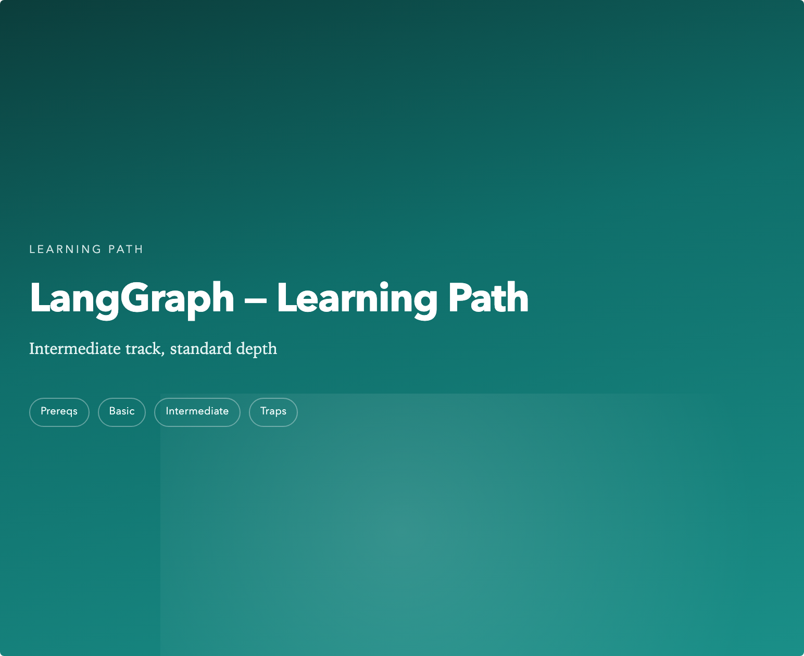
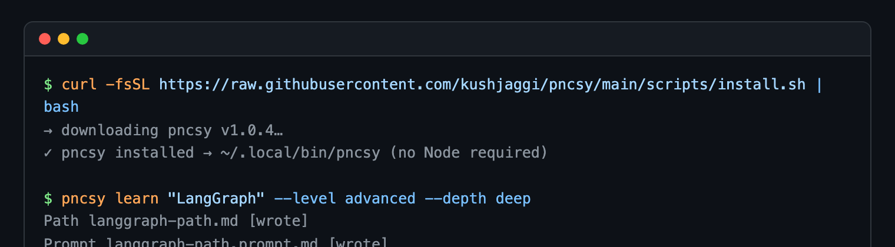
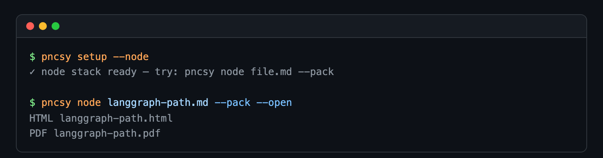
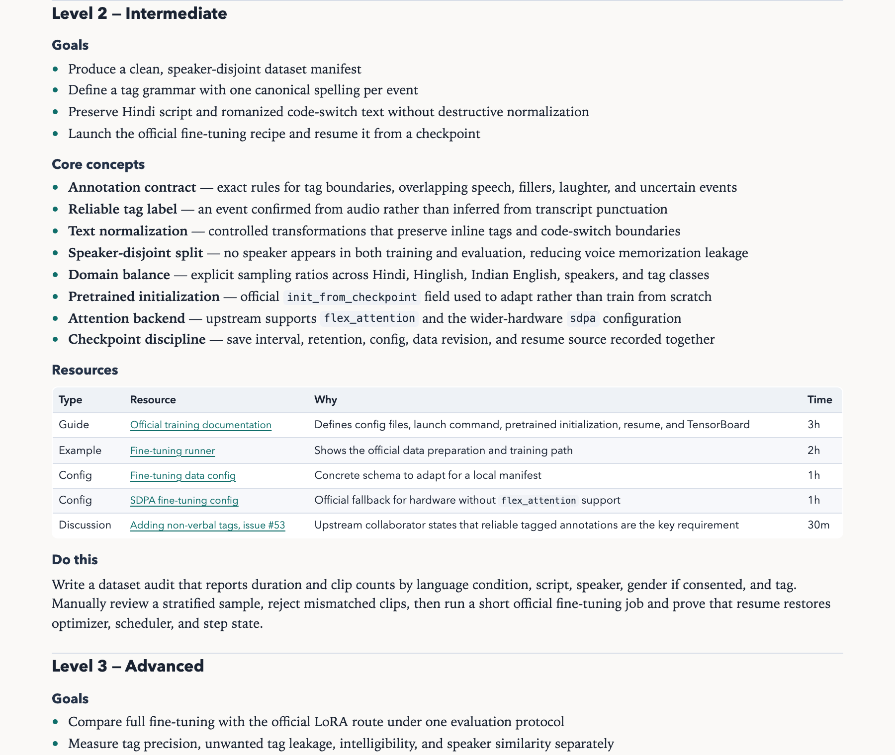
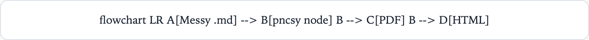
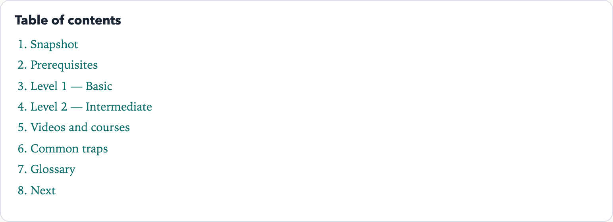

# pncsy

[](https://github.com/kushjaggi/pncsy/releases)
[](https://github.com/kushjaggi/pncsy#install)

**Prompting nahi, coding sikho.**

Turn vague “teach me X” prompts and messy agent Markdown into **structured learning paths** and **share-ready PDF/HTML** — same shape every time, zero deps in your project.

<p align="center">
  
</p>

---

## What you get

| | Learning paths | Document shipping |
|---|---|---|
| **Command** | `pncsy learn "Kafka"` | `pncsy node guide.md --pack` |
| **Needs Node?** | No | Yes (one-time `pncsy setup --node`) |
| **Output** | `.md` scaffold + `.prompt.md` for your agent | PDF + HTML with cover, TOC, Mermaid |
| **Best for** | Roadmaps, syllabi, “where do I start?” | Sharing AI-written docs that don’t look like AI dumps |

---

## Install

One command. No Node, no npm, no clone.

```bash
curl -fsSL https://raw.githubusercontent.com/kushjaggi/pncsy/main/scripts/install.sh | bash
```

<p align="center">
  
</p>

Installs to `~/.local/share/pncsy`, symlinks `pncsy` into `~/.local/bin`.  
Pin a version: `PNCSY_VERSION=1.0.4 curl -fsSL …/install.sh | bash`

---

## 30-second start

```bash
# 1. scaffold (works immediately — pure bash)
pncsy learn "LangGraph" --level advanced --depth deep

# 2. let your AI agent fill langgraph-path.md using langgraph-path.prompt.md

# 3. ship (needs Node — run once: pncsy setup --node)
pncsy node langgraph-path.md --pack --open
```

<p align="center">
  
</p>

---

## Output gallery

<p align="center">
  
</p>

<p align="center">
  
  &nbsp;&nbsp;
  
</p>

---

## Learning paths

Every run writes **two files** in a fixed order:

| File | Purpose |
|------|---------|
| `<topic>-path.md` | Scaffold — every section, every heading, same shape |
| `<topic>-path.prompt.md` | Fill prompt for your agent (editable; your edits win) |

```bash
pncsy learn "Kafka" --level advanced --depth deep -o ./plans
```

**Levels** (ladder stops at your target): `basic` → `intermediate` → `advanced` → `expert`  
**Depth** (how much per level): `quick` | `standard` | `deep`

| Depth | Concepts/level | Resources | Papers section |
|-------|----------------|-----------|----------------|
| `quick` | 3 | 2 | No |
| `standard` | 5 | 3 | Advanced+ only |
| `deep` | 8 | 5 | Yes |

**Sections in every path:** Snapshot · Prerequisites · Level ladder (goals, concepts, resources, hands-on) · Videos · Papers (when warranted) · Traps · Glossary · Next

**Agent workflow**

1. `pncsy learn "topic" …`
2. Agent reads `.prompt.md`, fills `.md` in place — keep every heading; tag uncertain links `(verify)`
3. `pncsy node "<slug>-path.md" --pack --open`

Custom structure: `pncsy node learn --init-config` → edit `pncsy.learn.json`

---

## Ship any Markdown

Requires Node stack once: `pncsy setup --node`

```bash
pncsy node README.md              # PDF
pncsy node guide.md --html        # HTML only
pncsy node guide.md --pack        # both
pncsy node docs/                  # whole folder
```

**What it does to ugly AI dumps**

- Strips chatty openings (`--no-polish` to keep raw)
- Teal cover from `#` title + subtitle + chips (`--no-cover` to skip)
- Auto TOC when ≥3 `##` headings (`--no-toc` to skip)
- Renders Mermaid diagrams inline
- Reads YAML frontmatter (`title`, `subtitle`, `chips`, `format`)

```yaml
---
title: My Doc
subtitle: Share-ready version
chips: [API, Auth, Deploy]
format: pack
---
```

| Flag | Effect |
|------|--------|
| `--subtitle` / `--chips` / `--kicker` | Cover metadata |
| `--no-html-keep` | Drop intermediate HTML after PDF |
| `--json` | Machine-readable `{ ok, results }` on stdout |
| `--chrome <path>` | Override browser binary |

---

## AI editor setup

Works in Cursor, Claude Code, Windsurf, Cline, Copilot — any agent with shell access.

```bash
curl -fsSL https://raw.githubusercontent.com/kushjaggi/pncsy/main/scripts/install.sh | bash
ln -sfn ~/.local/share/pncsy/skill ~/.cursor/skills/pncsy    # Cursor
ln -sfn ~/.local/share/pncsy/skill ~/.claude/skills/pncsy    # Claude Code
```

No skills folder? Drop **`AGENTS.md`** in your project — agents read it and know when to call `pncsy`.

Full per-editor steps: **[skill/INSTALL.md](skill/INSTALL.md)**

---

## Commands

```bash
pncsy learn "<topic>" [options]     # learning path — no Node
pncsy node <file.md|dir> [options]  # ship PDF/HTML — needs Node
pncsy node learn --init-config      # custom pncsy.learn.json
pncsy setup                         # what's installed
pncsy setup --node                  # fetch Node deps (one-time)
```

Compat aliases: `inkship`, `mdpdf` → both call `pncsy`.

---

## Project layout

```
pncsy/
├── bin/pncsy              # CLI router (bash + optional node)
├── scripts/
│   ├── learn.sh           # Learning paths (bash, no Node)
│   ├── pncsy.mjs          # Markdown → PDF/HTML (Node)
│   ├── learn.mjs          # Full learn + config (Node)
│   └── theme.css          # Print theme (teal cover)
├── skill/SKILL.md         # Agent skill for any editor
├── AGENTS.md              # Universal agent instructions
└── examples/demo/         # LangGraph demo path
```

---

## Maintainers

```bash
node scripts/check.mjs                  # 15 self-tests (incl. bash/node parity)
node scripts/capture-screenshots.mjs    # regenerate docs/screenshots/
```

---

## License

MIT · [kushjaggi](https://github.com/kushjaggi)
