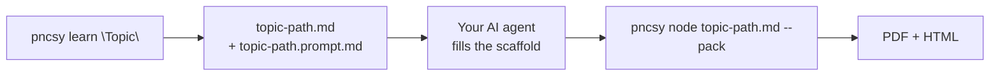

# pncsy

[](https://github.com/kushjaggi/pncsy/releases)
[](https://github.com/kushjaggi/pncsy#install)
[](LICENSE)

**Prompting nahi, coding sikho.**

A CLI that turns “teach me X” and messy agent Markdown into **structured learning paths** and **share-ready PDF/HTML** — same shape every time, nothing installed in your project.

<p align="center">
  
</p>

<p align="center">
  <a href="#install">Install</a> ·
  <a href="#how-it-works">How it works</a> ·
  <a href="#learning-paths">Learning paths</a> ·
  <a href="#ship-docs">Ship docs</a> ·
  <a href="#ai-editors">AI editors</a> ·
  <a href="examples/demo/langgraph-path.md">Live example</a>
</p>

---

## The problem

| Today | With `pncsy` |
|-------|--------------|
| “Make me a Kafka roadmap” → different shape every time | Fixed ladder + sections + fill prompt — same structure, any model |
| Agent dumps 40 pages of `.md` → you forward it raw | Polish → cover → auto TOC → Mermaid → PDF/HTML |
| Doc tools want `npm install` in *your* repo | One curl install; deps live in `~/.local/share/pncsy` only |

---

## How it works



**Two commands. Two tiers.**

| | `pncsy learn` | `pncsy node` |
|---|---|---|
| **Runtime** | bash only | Node 18+ (opt-in) |
| **You get** | Scaffold + agent prompt | PDF, HTML, rendered Mermaid |
| **Use when** | Roadmap, syllabus, “where do I start?” | Sharing docs that should look finished |

---

## Install

```bash
curl -fsSL https://raw.githubusercontent.com/kushjaggi/pncsy/main/scripts/install.sh | bash
```

No Node. No npm. No clone. Adds `pncsy` to `~/.local/bin`.

<p align="center">
  
</p>

```bash
# pin a release
PNCSY_VERSION=1.0.4 curl -fsSL https://raw.githubusercontent.com/kushjaggi/pncsy/main/scripts/install.sh | bash
```

Then try it:

```bash
pncsy learn "LangGraph" --level advanced --depth deep
# → langgraph-path.md + langgraph-path.prompt.md

# when ready to ship (one-time: pncsy setup --node)
pncsy node langgraph-path.md --pack --open
```

<p align="center">
  
</p>

---

## Output

<p align="center">
  
</p>

<p align="center">
  
  &nbsp;&nbsp;
  
</p>

See a filled example: **[examples/demo/langgraph-path.md](examples/demo/langgraph-path.md)** · [PDF](examples/demo/langgraph-path.pdf)

---

## Learning paths

Every `pncsy learn` run writes **two files**:

| File | What it is |
|------|------------|
| `<topic>-path.md` | Scaffold — fixed headings, tables, level ladder |
| `<topic>-path.prompt.md` | Instructions for your agent to fill it (edit this freely) |

```bash
pncsy learn "Kafka" --level advanced --depth deep -o ./plans
```

**Level** — ladder stops at your target: `basic` → `intermediate` → `advanced` → `expert`  
**Depth** — how much per level: `quick` · `standard` · `deep`

| Depth | Concepts | Resources | Papers |
|-------|----------|-----------|--------|
| quick | 3 | 2 | — |
| standard | 5 | 3 | at advanced+ |
| deep | 8 | 5 | yes |

**Every path includes:** Snapshot · Prerequisites (with self-checks) · Level ladder (goals, concepts, resources, hands-on task) · Videos · Papers (when depth warrants) · Common traps · Glossary · Next steps

### Agent workflow

1. Run `pncsy learn "topic" …`
2. Open `.prompt.md` — tell your agent: *fill `.md` in place; keep every heading; tag uncertain links `(verify)`*
3. Ship: `pncsy node "<slug>-path.md" --pack --open`

Re-running `learn` keeps your edits. Use `--force` only when you want a clean slate.

<details>
<summary><strong>Custom structure</strong> (needs Node)</summary>

```bash
pncsy node learn --init-config    # writes pncsy.learn.json
```

Lookup: `--config <file>` → `./pncsy.learn.json` → `~/.config/pncsy/learn.json` → built-in defaults.

```jsonc
{
  "levels": ["beginner", "working", "expert"],
  "depths": { "standard": { "concepts": 6 } },
  "sections": [
    { "id": "interview", "title": "Interview Q&A", "body": "| Q | A |\n|---|---|" }
  ],
  "promptRules": ["Your custom fill rules."]
}
```

Tokens: `{{topic}}` `{{levelTitle}}` `{{concepts}}` `{{ladder}}` — see [learn.default.mjs](scripts/learn.default.mjs).

</details>

---

## Ship docs

Any `.md` file — learning paths, READMEs, agent dumps. Requires Node once:

```bash
pncsy setup --node    # one-time
```

```bash
pncsy node README.md           # PDF (default)
pncsy node guide.md --html     # HTML only
pncsy node guide.md --pack     # both
pncsy node docs/               # every .md in a folder
```

**Transforms on ship:**

- Strips “Sure! Here’s a comprehensive guide…” openings (`--no-polish` to keep)
- Teal cover page from `#` title + subtitle + chips
- Auto table of contents when ≥3 `##` headings
- Renders Mermaid diagrams (not raw code fences)
- YAML frontmatter: `title`, `subtitle`, `chips`, `format`

```yaml
---
title: My Doc
subtitle: Share-ready version
chips: [API, Auth, Deploy]
format: pack
---
```

<details>
<summary><strong>All ship flags</strong></summary>

| Flag | Effect |
|------|--------|
| `--subtitle` / `--chips` / `--kicker` | Cover metadata |
| `--no-cover` / `--no-toc` / `--no-polish` | Skip cover, TOC, or fluff cleanup |
| `--no-html-keep` | Delete intermediate HTML after PDF |
| `--json` | `{ ok, results }` on stdout for agents |
| `--chrome <path>` | Override browser binary |

</details>

---

## AI editors

Works with **Cursor, Claude Code, Windsurf, Cline, Copilot** — anything that can run shell commands.

```bash
curl -fsSL https://raw.githubusercontent.com/kushjaggi/pncsy/main/scripts/install.sh | bash
ln -sfn ~/.local/share/pncsy/skill ~/.cursor/skills/pncsy
```

No skills folder? Put **[AGENTS.md](AGENTS.md)** in your project root — agents pick up when and how to call `pncsy`.

Per-editor setup: **[skill/INSTALL.md](skill/INSTALL.md)**

---

## Commands

```bash
pncsy learn "<topic>" [options]      # scaffold — no Node
pncsy node <file.md|dir> [options]   # ship PDF/HTML — needs Node
pncsy setup                          # install status
pncsy setup --node                   # fetch Node deps
pncsy node learn --init-config       # custom config template
```

Aliases: `inkship`, `mdpdf` → `pncsy`

<details>
<summary><strong>Project layout & maintainers</strong></summary>

```
pncsy/
├── bin/pncsy           # CLI router
├── scripts/learn.sh    # learn (bash)
├── scripts/pncsy.mjs   # ship (Node)
├── skill/SKILL.md      # agent skill
└── AGENTS.md           # universal agent rules
```

```bash
node scripts/check.mjs                 # 15 tests (bash/node parity)
node scripts/capture-screenshots.mjs   # regenerate README images
```

</details>

---

## License

MIT · [kushjaggi](https://github.com/kushjaggi)
