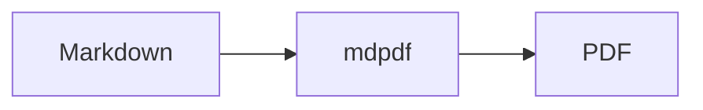

# mdpdf sample

> Convert this file with `mdpdf examples/sample.md --open`

## Why

Turn Markdown into a **styled PDF** without wiring printers by hand.

## Mermaid



## Table

| Step | Action |
|------|--------|
| 1 | Install |
| 2 | Run `mdpdf file.md` |
| 3 | Open the PDF |

## Code

```js
console.log("hello from mdpdf");
```
