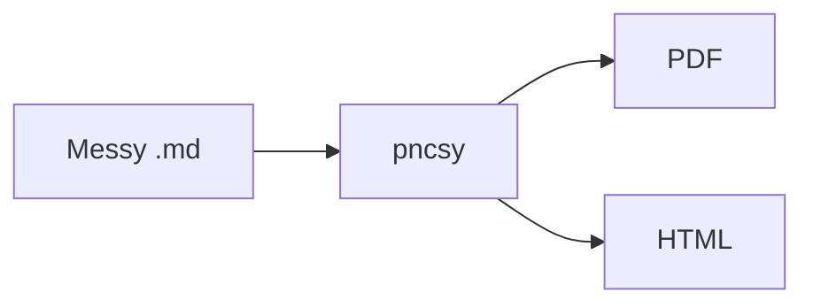

# pncsy sample

Sure! I'd be happy to help you understand this tool in a comprehensive guide.

Here is a detailed overview of how shipping Markdown works when you need something people can actually open.

## Why

AI dumps long Markdown. Forward raw → looks bad. `pncsy` ships cover, TOC, diagrams, PDF/HTML.

## Flow



## Table

| Step | Action |
|------|--------|
| 1 | `npm install && npm link` |
| 2 | `pncsy file.md --open` |
| 3 | Send the PDF |

## Code

```js
console.log("shipped");
```

## More headings for TOC

Enough `##` sections trigger auto table of contents when you ship.
